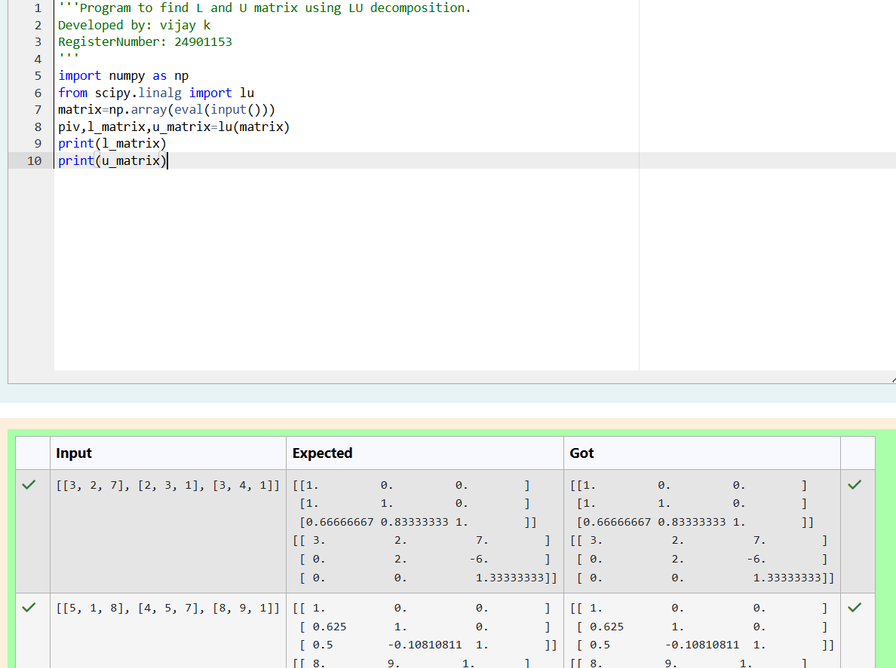
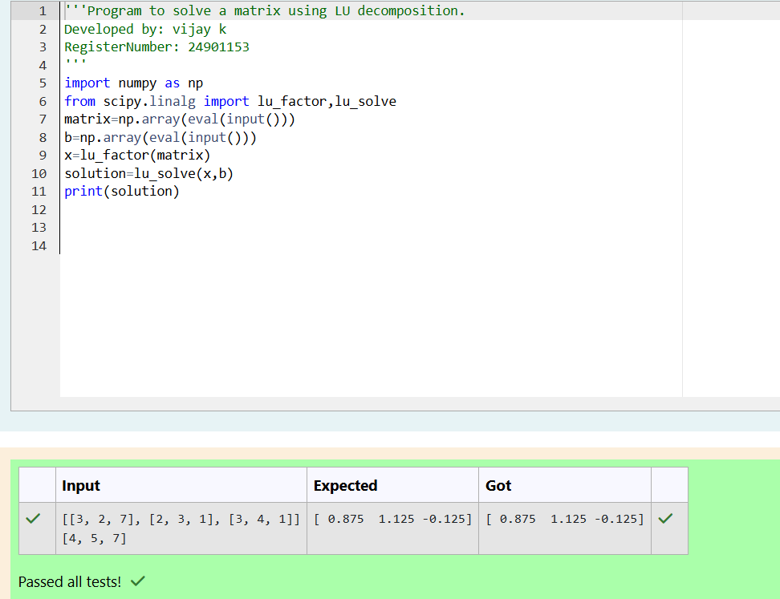

# LU Decomposition 

## AIM:
To write a program to find the LU Decomposition of a matrix.

## Equipments Required:
1. Hardware – PCs
2. Anaconda – Python 3.7 Installation / Moodle-Code Runner

## Algorithm
1.
(i) find the 1 and u matirx by using numpy and linalg from scipy

(ii)print the 1 matrix and u matirx

(iii)find the lu decomposition by using numpy and lu_factor and lu_solve

(iv)print the the following  matrix
2. 
()iIn second program can import lo factor and lu selve from python library as same as in second program.

(ii)Get the input from user in the form of nested list to compute numpy array format and declare it for both the variables

(iii)Create the variable to Use inputted array to compute of lu, factor of matrix varaible.

(iv)Create the new variable for a solve to compute of x variable and b' variable.

(v)Print the corresponding variable (solution) to get the output
 

## Program:
(i) To find the L and U matrix
```
/*
Program to find the L and U matrix.
Developed by: vijay k
RegisterNumber: 24901153
*/
import numpy as np
from scipy.linalg import lu
matrix=np.array(eval(input()))
piv,l_matrix,u_matrix=lu(matrix)
print(l_matrix)
print(u_matrix)
```
(ii) To find the LU Decomposition of a matrix
```
/*
Program to find the LU Decomposition of a matrix.
Developed by: vijay k
RegisterNumber: 24901153
*/
import numpy as np
from scipy.linalg import lu_factor,lu_solve
matrix=np.array(eval(input()))
b=np.array(eval(input()))
x=lu_factor(matrix)
solution=lu_solve(x,b)
print(solution)
```

## Output:




## Result:
Thus the program to find the LU Decomposition of a matrix is written and verified using python programming.

